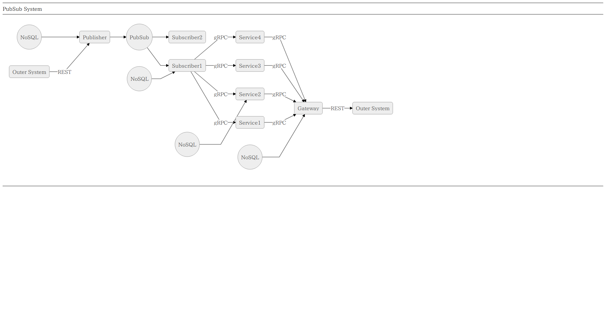
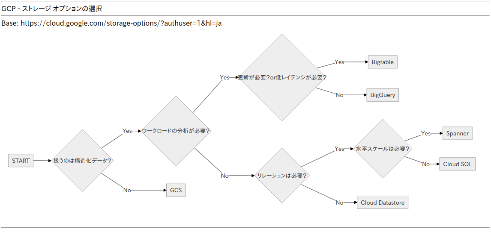
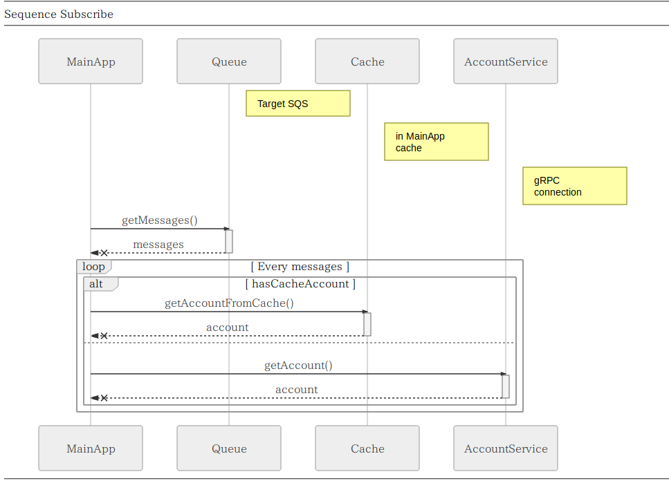
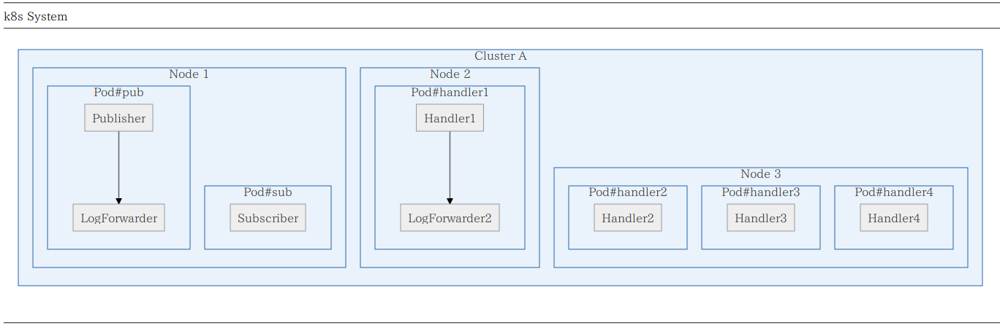

# try-mermaidjs

## ■Version

7.1.2

## ■Ref

https://github.com/knsv/mermaid

https://mermaidjs.github.io/

## ■Example

### 【フローチャート】

こう書くと
<pre>
    graph LR;
      OS(Outer System) -- REST --> PUB(Publisher);
      PUB --> PS((PubSub));
      PS --> SUB(Subscriber1);
      PS --> SUB2(Subscriber2);
      SUB -- gRPC --> S1(Service1);
      SUB -- gRPC --> S2(Service2);
      SUB -- gRPC --> S3(Service3);
      SUB -- gRPC --> S4(Service4);
      S1 -- gRPC --> GW(Gateway);
      S2 -- gRPC --> GW;
      S3 -- gRPC --> GW;
      S4 -- gRPC --> GW;
      GW -- REST --> OS2(Outer System);

      DS((NoSQL)) --> PUB;
      DS2((NoSQL)) --> SUB;
      DS3((NoSQL)) --> S2;
      DS4((NoSQL)) --> GW;
</pre>

こう表示される

こう書くと
<pre>
    graph LR;
      START --> D01{"扱うのは構造化データ？"};

      D01 -->|Yes| D02{"ワークロードの分析が必要？"};
      D01 -->|No| Obj01["GCS"];

      D02 -->|Yes| D03{"更新が必要？or低レイテンシが必要？"};
      D02 -->|No| D04{"リレーションは必要？"};

      D03 -->|Yes| Obj02["Bigtable"];
      D03 -->|No| Obj03["BigQuery"];

      D04 -->|Yes| D05{"水平スケールは必要？"};
      D04 -->|No| Obj04["Cloud Datastore"];

      D05 -->|Yes| Obj05["Spanner"];
      D05 -->|No| Obj06["Cloud SQL"];
</pre>

こう表示される

### 【シーケンス図】

こう書くと
<pre>
    sequenceDiagram
      participant M as MainApp

      participant Q as Queue
      Note right of Q: Target SQS

      participant C as Cache
      Note right of C: in MainApp cache

      participant A as AccountService
      Note right of A: gRPC connection

      M ->> +Q: getMessages()
      Q --x -M: messages

      loop Every messages

        alt hasCacheAccount
          M ->> +C: getAccountFromCache()
          C --x -M: account
        else
          M ->> +A: getAccount()
          A --x -M: account
        end

      end
</pre>

こう表示される

### 【サブグラフ】

こう書くと
<pre>
    graph TB
      subgraph Cluster A
        subgraph Node 1
          subgraph Pod#pub
            Publisher-->LogForwarder
          end
          subgraph Pod#sub
            Subscriber
          end
        end
        subgraph Node 2
          subgraph Pod#handler1
            Handler1-->LogForwarder2
          end
        end
        subgraph Node 3
          subgraph Pod#handler2
            Handler2
          end
          subgraph Pod#handler3
            Handler3
          end
          subgraph Pod#handler4
            Handler4
          end
        end
      end
</pre>

こう表示される

