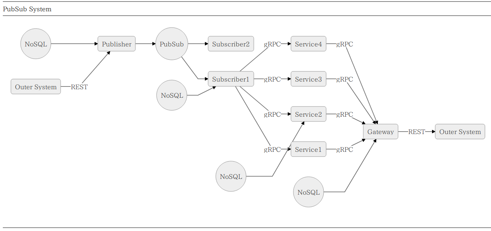

# try-mermaidjs

## Ref

https://github.com/knsv/mermaid
https://mermaidjs.github.io/

## Sample

Source

<pre>
    graph LR;
      OS(Outer System) -- REST --> PUB(Publisher);
      PUB --> PS((PubSub));
      PS --> SUB(Subscriber1);
      PS --> SUB2(Subscriber2);
      SUB -- gRPC --> S1(Service1);
      SUB -- gRPC --> S2(Service2);
      SUB -- gRPC --> S3(Service3);
      SUB -- gRPC --> S4(Service4);
      S1 -- gRPC --> GW(Gateway);
      S2 -- gRPC --> GW;
      S3 -- gRPC --> GW;
      S4 -- gRPC --> GW;
      GW -- REST --> OS2(Outer System);

      DS((NoSQL)) --> PUB;
      DS2((NoSQL)) --> SUB;
      DS3((NoSQL)) --> S2;
      DS4((NoSQL)) --> GW;
</pre>
